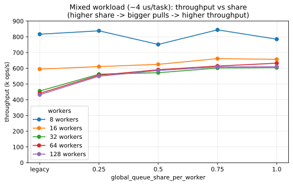
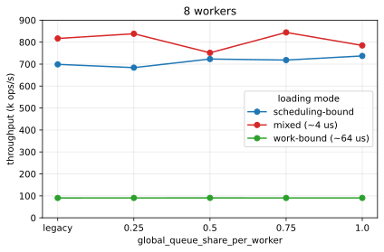
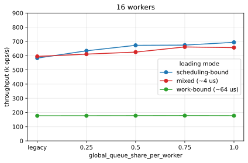
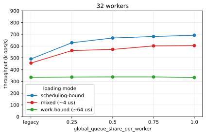
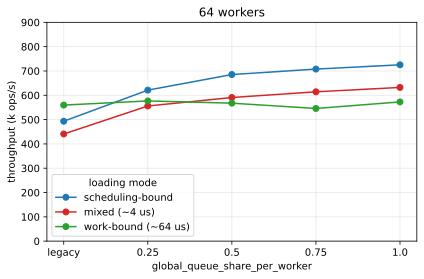
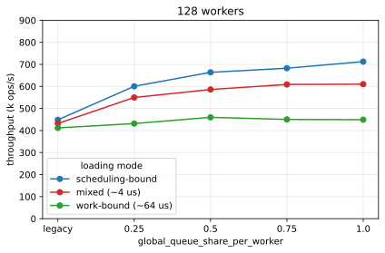

# tokio `global_queue_share_per_worker` benchmarks

Benchmarks for a proposed multi-threaded tokio runtime tuning knob,
`Builder::global_queue_share_per_worker`, which sets the fraction of the global
(injection) task queue a worker takes each time it pulls a batch.

> Built against the `global-queue-equitability` branch of
> [johnhurt/tokio](https://github.com/johnhurt/tokio/tree/global-queue-equitability).
> The knob and the runtime metrics used here are `tokio_unstable`.

## Background

When a multi-threaded tokio runtime worker runs out of local work, it pulls a
batch of tasks from the global injection queue rather than draining it
completely, so other workers can also grab work. Both sides of that queue are
guarded by a single mutex: tasks are *pushed* onto it whenever a task is woken
from a non-worker thread (a `spawn_blocking` completion, a timer, a
`Handle::spawn` from an external thread), and worker threads *pop* batches off
it.

By default a worker takes a `1 / N` share, where `N` is the number of worker
threads. When `N` is large that share shrinks toward a single task, so each
worker re-locks the mutex very frequently — turning the global queue mutex into
a serialization point under a high scheduling rate.

The proposed knob takes a fixed `share` in `0.0..=1.0` and **drops the worker
count from the formula entirely**: with `len` tasks in the queue, a worker takes
`ceil(len * share)` per pull (at least one, still capped by local-queue space).

| `share`   | behaviour                                                       |
| --------- | --------------------------------------------------------------- |
| unset     | the default `1 / N` share (shown as "legacy" below)             |
| `1.0`     | drain the whole queue in one lock acquisition (greediest)       |
| small     | take a sliver per lock (most even, most contention)             |

Larger shares replace many small, contended global-queue pops with a few bulk
grabs; the work then redistributes between workers via (cheaper, per-worker)
work-stealing.

## What the benchmarks do

Both binaries emit one JSON line per run with throughput and runtime metrics
(`global_queue_depth`, `worker_overflow_count`, `remote_schedule_count`,
`worker_steal_count`).

### `flood` — global-queue-mutex-bound

`producers` external OS threads hammer `Handle::spawn`. Every such spawn locks
the global mutex to push; workers lock it to pull batches. A per-task `spin`
parameter sets how much CPU each task burns, moving the workload between
**scheduling-bound** (`spin = 0`, the mutex dominates) and **work-bound**
(large `spin`, the scheduler is a small fraction). A `share` of `0` (or less)
leaves the knob unset (legacy `1 / N`).

```
flood <workers> <share> <producers> <total_ops> <spin>
```

### `file_server` — `spawn_blocking` request shape

Many concurrent requests, each fanning out several `spawn_blocking` "file
reads", awaiting them, then completing. This models the obvious "requests that
read files" shape — and demonstrates a limitation (see *Caveats*): it
bottlenecks on the blocking pool before the global-queue mutex, so the knob
barely moves throughput here.

```
file_server <workers> <share> <req_concurrency> <reads_per_req> <read_spin> <total_requests> <blocking_threads>
```

## Running

```sh
cargo build --release            # --cfg tokio_unstable is set in .cargo/config.toml
./scripts/sweep.sh               # sweeps workers x loading mode x share -> data/grid.jsonl
python3 scripts/plot.py          # regenerate the SVGs
python3 scripts/aggregate.py data/grid.jsonl workers throughput_ops_per_s spin=0
```

Fetching the fork and crates.io dependencies requires network access; plotting
needs `matplotlib`.

## Results

### Test machine

| component | spec |
| --------- | ---- |
| Arch      | aarch64 |
| Cores     | 128 (1 thread per core) |
| RAM       | 501 GiB |
| OS        | Linux, kernel 6.18 |

Medians of repeated trials. Throughput is in thousands of ops/s; "legacy" is the
default `1 / N` share (knob unset). Three **loading modes** are swept against
`share` at each worker count:

| mode | per-task work | stands in for |
| ---- | ------------- | ------------- |
| scheduling-bound | none | a hot path / page-cache reads — the global-queue mutex dominates |
| mixed | ~4 µs | a little real work per task |
| work-bound | ~64 µs | heavy work per task — the scheduler is a small fraction |

### The headline: the win scales with worker count

The chart below uses the **mixed** loading mode — a realistic ~4 µs of work per
task. Each line is a worker count. Raising `share` is roughly neutral at low
core counts but a large win as cores grow:



`share=1.0` throughput vs `legacy` (`1 / N`), across all three loading modes:

| workers | scheduling-bound | mixed (~4 µs) | work-bound (~64 µs) |
| ------- | ---------------: | ------------: | ------------------: |
| 8       | +5%  | −4%  | +1% |
| 16      | +19% | +10% | 0%  |
| 32      | +41% | +32% | 0%  |
| 64      | **+47%** | **+43%** | +2% |
| 128     | **+59%** | **+41%** | +9% |

The legacy `1 / N` share sags as workers are added (each worker's share shrinks,
so it re-locks the mutex more often); any fixed `share` holds up, and the gap
widens with core count.

Scheduling-bound throughput (k ops/s):

| workers | legacy | 0.25 | 0.5 | 0.75 | 1.0 |
| ------- | -----: | ---: | --: | ---: | --: |
| 8   | 699 | 684 | 723 | 718 | 737 |
| 16  | 583 | 634 | 673 | 674 | 694 |
| 32  | 491 | 629 | 669 | 682 | 692 |
| 64  | 493 | 621 | 685 | 708 | 725 |
| 128 | 448 | 601 | 664 | 683 | 712 |

## Findings

- **Throughput scales with `share`, and the legacy `1 / N` penalty grows with
  worker count.** At 128 workers, `share=1.0` is ~50–60% faster than legacy on a
  scheduling-bound workload.
- **The benefit is a global-queue-mutex lever, not a universal one.** It is
  large when the runtime is bound by the global queue mutex and fades to noise
  on work-bound workloads (the scheduler is then a small fraction).
- **The mechanism is bulk-grab + work-stealing.** At legacy with many workers,
  each worker pops ~1 task per lock and almost never steals; at high `share` a
  worker bulk-grabs the queue and the rest pick it up by stealing, moving
  contention off the single global mutex onto distributed per-worker queues.
- **Default behaviour is unchanged.** Leaving the knob unset keeps the current
  `1 / N` share exactly.

## Caveats / limitations

- **The knob batches the *pop* side only.** Pushes onto the global queue are
  still one-at-a-time, so the win assumes pop-dominated contention (many workers
  each taking a tiny share). A push-dominated workload benefits less.
- **A default `spawn_blocking` file server may not reach this regime.** The
  `file_server` binary bottlenecks on tokio's blocking pool before the
  global-queue mutex. Reaching the mutex-bound regime needs completions fed to
  the runtime faster than the blocking pool allows (e.g. an io_uring / custom
  completion backend), which is what `flood` models.
- **The batch is also capped** at half the local run-queue capacity, so a large
  `share` only takes effect up to that cap on a very deep queue.

## Per-worker-count charts

One chart per worker count, each plotting throughput against `share` for all
three loading modes: **blue** = scheduling-bound, **red** = mixed (~4 µs),
**green** = work-bound (~64 µs). At low worker counts the lines are nearly flat
(little global-queue contention, so `share` barely matters); as the worker count
rises the scheduling-bound (blue) line — and, by 32+ workers, the mixed (red)
line too — develop a clear climb with `share`, while the work-bound (green) line
stays flat throughout. All charts share a 0–900 k ops/s y-axis so they are
directly comparable.











## Layout

```
src/bin/flood.rs        # global-queue-mutex-bound workload
src/bin/file_server.rs  # spawn_blocking request-fan-out workload
scripts/sweep.sh        # sweeps workers x loading mode x share -> data/grid.jsonl
scripts/aggregate.py    # *.jsonl -> markdown table (supports field=value filters)
scripts/plot.py         # data/grid.jsonl -> charts/*.svg (matplotlib)
data/grid.jsonl         # the measured data behind the charts in this README
charts/headline.svg     # mixed-mode headline chart
charts/worker_<N>.svg   # one chart per worker count
```
